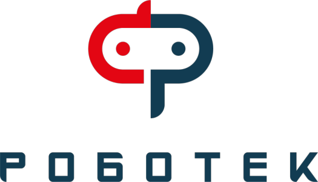
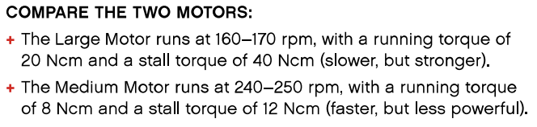

***

**Official repository of the Robotek Prime team from Kazakhstan. It contains all the engineering materials of our self-driven vehicle's model participating in the WRO Future Engineers competition in the season of 2023.**

***

***

## Contents

* [**Mobility Management**](#mobility-management)
* [**Power and Sense Management**](#power-and-sense-management)
* [**Obstacle Management**](#obstacle-management)
* [**Photos**](#photos)
  * [Team Photos](#team-photos)
  * [Vehicle Photos](#vehicle-photos)
* [**Performance Videos**](#performance-videos)
* [**Conclusion**](#conclusion)

***

## Mobility Management

### Motor Selection and Implementation

Motor selection is a crucial component of our vehicle's autonomous navigation system. The Lego MINDSTORMS EV3 set provides two distinct motor options: Large Motors and Medium Motors. In making our selection, we considered key factors such as rotation speed, torque, and encoder accuracy.

The Large Motor offers substantial power, however, the Medium Motor, while less powerful, is smaller and lighter. This compact size facilitates quicker responses and conserves space within our vehicle design.
Given the constraints of our compact vehicle dimensions (300x200x300mm) and the emphasis on high-speed navigation, we prioritized the Medium Motor for both the steering and driving mechanisms. Our vehicle employs three Medium motors for its movement system: one for steering and two for driving.

### Chassis Design and Implementation

The steering mechanism, located in the front, utilizes smaller wheels, while the driving mechanism at the rear incorporates larger Lego Technic wheels placed closely together.
The placement of larger wheels at the rear serves multiple practical purposes. Larger wheels cover more ground per revolution, resulting in higher linear speed, which aligns with our priority for speed in the competition. Additionally, positioning the larger rear wheels as close to each other as possible, known as a "narrow rear track," mitigates the absence of a differential system. A narrow rear track minimizes the difference in wheel paths during turns, enhancing the vehicle's maneuverability and reducing wheel scrub.

***

## Power and Sense Management

### Used Sensors

Our autonomous vehicle relies on a combination of sensors to execute precise movements, crucial for both obstacle avoidance and the qualification challenges of the competition.

Color Sensor: This sensor is employed to identify turns and determine the driving direction by reading colored lines (orange or blue) on the competition field.

Ultrasonic Sensor: Positioned at the front of the vehicle, the ultrasonic sensor measures the distance between the vehicle and field barriers, ensuring that the vehicle's relative position before and after a turn is continuously known.

Gyro Sensor: The gyro sensor plays a pivotal role in maintaining proper alignment. It detects changes in the vehicle's driving angle, alerting the system to any misalignment or deviation. The implementation of a PID (Proportional-Integral-Derivative) regulator ensures that any deviation from the desired steering angle is continuously corrected, guaranteeing the vehicle's straight and precise trajectory.

The PID regulator operates in a continuous loop throughout the program, ensuring the vehicle remains aligned and on the intended path, supporting its autonomous navigation capabilities.

***

## Obstacle Management

***

## Photos

### Team Photos

### Vehicle Photos

***

## Performance Videos

***

## Conclusion

***

